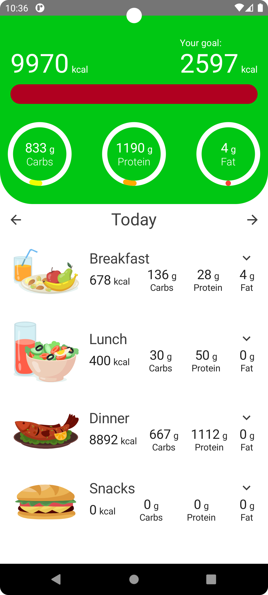
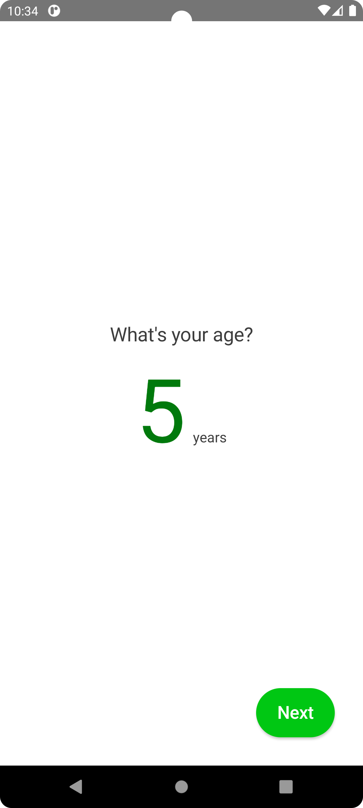
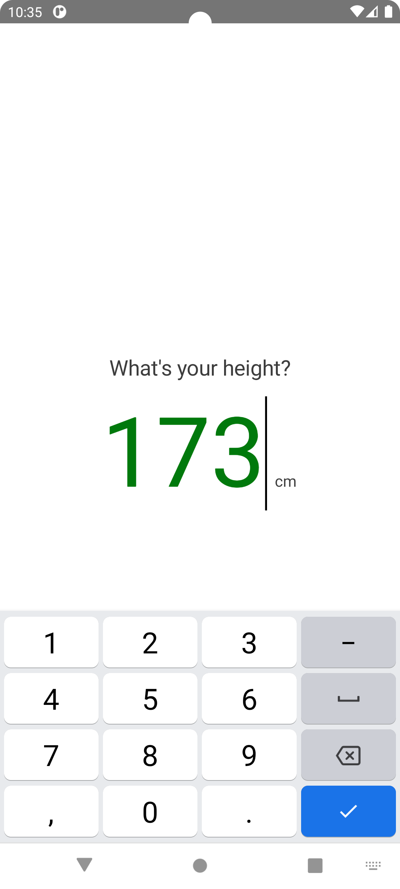
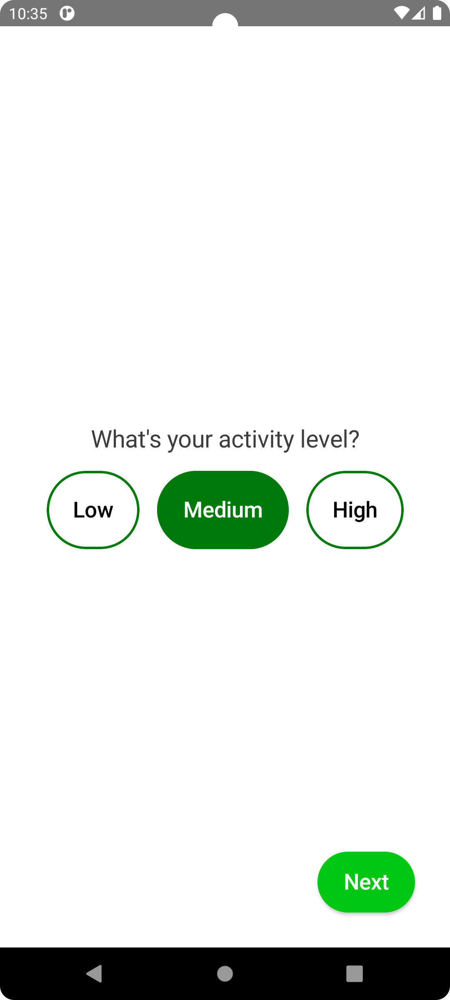
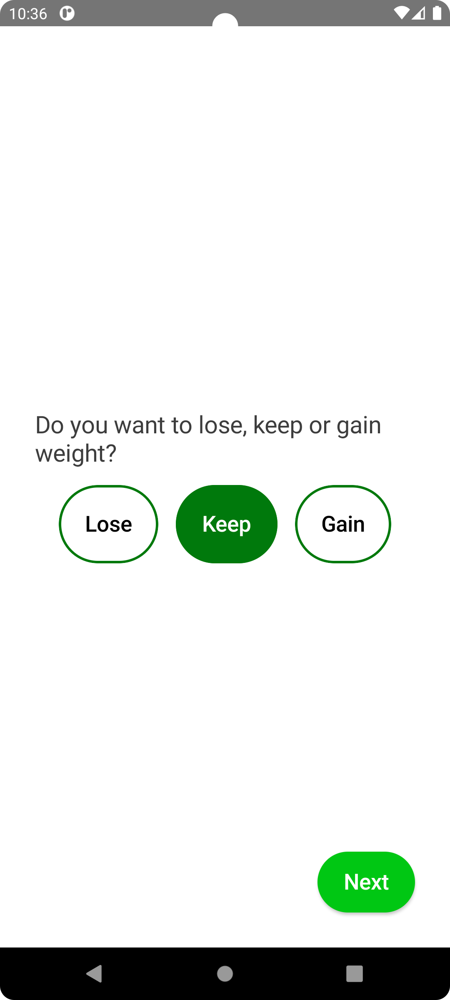
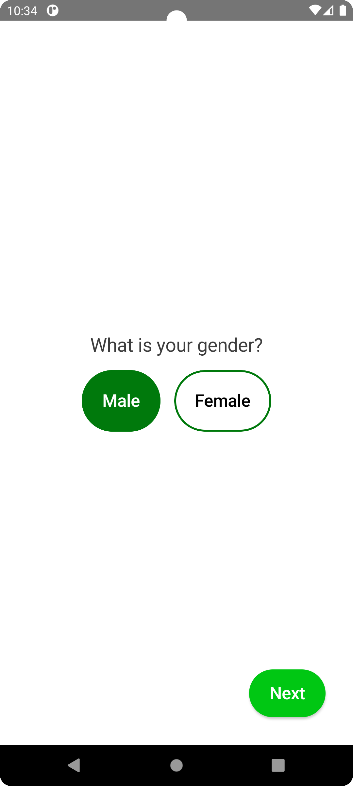
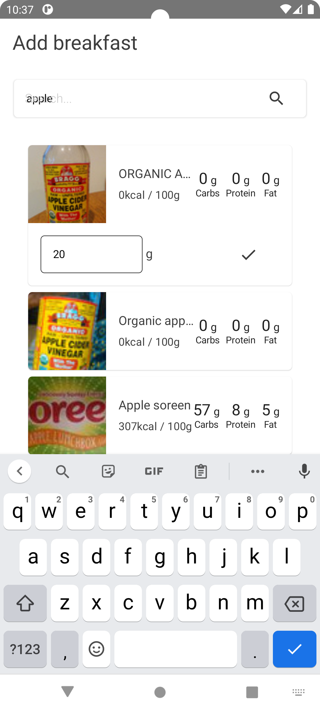
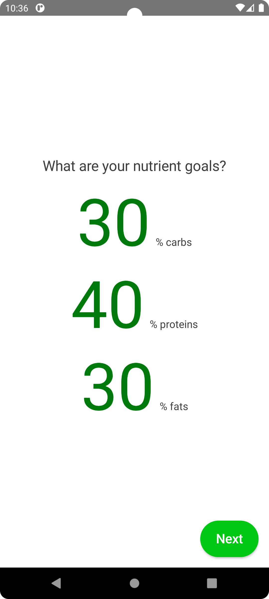
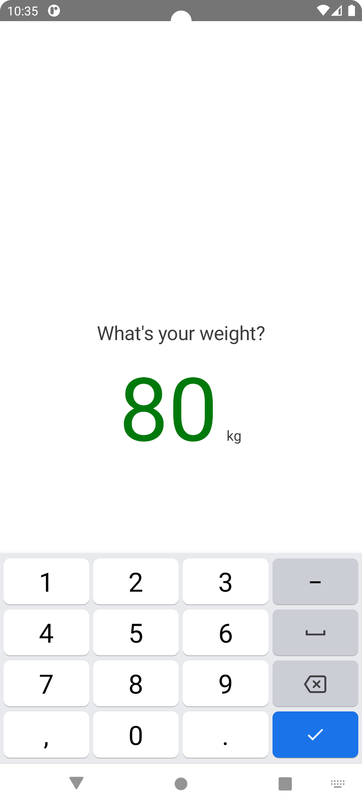

  

<h1 align="center">Fit Balance App</h1>

"Fit-Balance: Your comprehensive fitness and calorie tracking app. Easy calorie logging, and nutritional guidance for achieving your health goals."

## Tech Stacks

- <b>Clean Architecture:</b> Utilize App Feature-based Strategy in Clean Arch.
- <b>Jetpack Compose:</b> Used Modern Tech of Jetpack Compose.
- <b>Shared Preferences:</b> Used for Saving User Preferences ex: Goal, Gender... etc.
- <b>MVVM Architecture:</b> Used for each feature module.

## Screenshots

|                  Main Screen                      |                   Age Screen                       |                    Height Screen                      |
|:-------------------------------------------------:|:--------------------------------------------------:|:-----------------------------------------------------:|
|                      |                        |                     |
|                   Activity Level                  |                  Goal Screen                       |                    Gender Screen                      |
|        |                            |                     |
|                 Add Meal Screen                   |                 Nutrient Goals                     |                    Weight Screen                      |
|               |         |                     |

